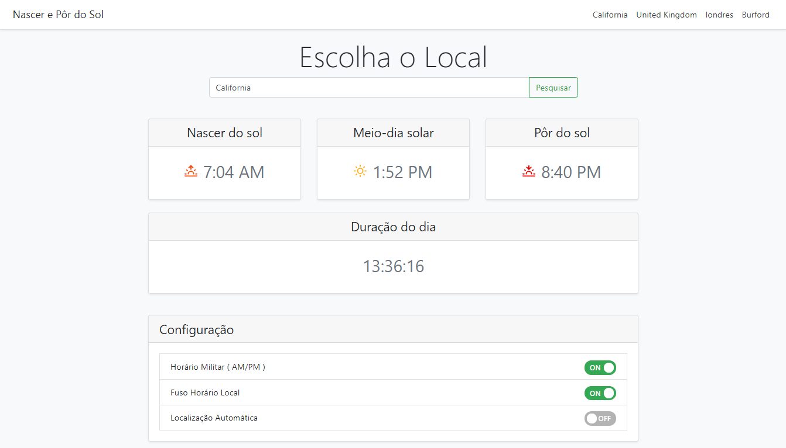

# Nascer e Pôr do Sol

This app allows the user to find sunrise and sunset times  

## Contributors 

-   **Giamo Lao**
-   **Gintautas Stirbys**

## Project Requirements

- [x] Use a CSS framework other than Bootstrap.
- [x] Be deployed to GitHub Pages. 
- [x] Be interactive (i.e., accept and respond to user input).
- [x] Use at least two server-side APIs.
- [x] Does not use alerts, confirms, or prompts (use modals).
- [x] Use client-side storage to store persistent data. 
- [x] Be responsive.
- [x] Have a polished UI. 
- [x] Have a clean repository that meets quality coding standards (file structure, naming conventions, follows best practices for class/id naming  conventions, indentation, quality comments, etc.).
- [x] Have a quality README.
- [x] Finally, you must add your project to the portfolio that you created in Module 2.

 

## Links

Link to the [Github Repository](https://technicalparadox.github.io/)  

Link to the [Deployed Webiste](https://technicalparadox.github.io/solar-time-tracker/) 

Link to [Giamo's Portfolio](https://technicalparadox.github.io/)

Link to [Gint's Portfolio](https://gintstir.github.io/Portfolio/) 

## Screenshots 

Screenshot of website:

> 

 

## **Motivation**

This group project allowed us to practice a wide range of new skills including but not limited to:

- Becoming more adept at managing Github worklflow.
- Learning and implementing a new CSS framework.
- Navigating and problem solving merge conflicts using Git and Github.

## Tech/Framework Used

This project was built from the ground up using:
- CSS
- HTML
- JavaScript
- jQuery
- <a href="https://bulma.io/" target="_blank">Bulma</a>
- <a href="https://fontawesome.com/" target="_blank">FontAwesome</a>
 

## API Reference

This project uses calls to the following APIs:

 - <a href="https://sunrise-sunset.org/api" target="_blank">Sunrise-Sunset API</a>
 - <a href="https://opencagedata.com/api" target="_blank">OpenCage API</a>
 - <a href="https://moment.github.io/luxon/docs/identifiers.html" target="_blank">Luxon</a>

## License
 
 
**MIT License**
 

Copyright © 2020 Giamo Lao & Gintautas Stirbys

Permission is hereby granted, free of charge, to any person obtaining a copy of this software and associated documentation files (the "Software"), to deal in the Software without restriction, including without limitation the rights to use, copy, modify, merge, publish, distribute, sublicense, and/or sell copies of the Software, and to permit persons to whom the Software is furnished to do so, subject to the following conditions:

The above copyright notice and this permission notice shall be included in all copies or substantial portions of the Software.

THE SOFTWARE IS PROVIDED "AS IS", WITHOUT WARRANTY OF ANY KIND, EXPRESS OR IMPLIED, INCLUDING BUT NOT LIMITED TO THE WARRANTIES OF MERCHANTABILITY, FITNESS FOR A PARTICULAR PURPOSE AND NONINFRINGEMENT. IN NO EVENT SHALL THE AUTHORS OR COPYRIGHT HOLDERS BE LIABLE FOR ANY CLAIM, DAMAGES OR OTHER LIABILITY, WHETHER IN AN ACTION OF CONTRACT, TORT OR OTHERWISE, ARISING FROM, OUT OF OR IN CONNECTION WITH THE SOFTWARE OR THE USE OR OTHER DEALINGS IN THE SOFTWARE.

## **Credits**

Thank you to @Iconixar from <a href="https://www.flaticon.com/authors/iconixar">flaticon.</a>  

Thank you to <a href="https://opensource.org/licenses/MIT">Open Source Initiative</a> for the license found above.  

Thanks to UPennLPS Coding Bootcamp. Thank you to the bootcamp instructors and TA's for all their help along the way ❤.  

